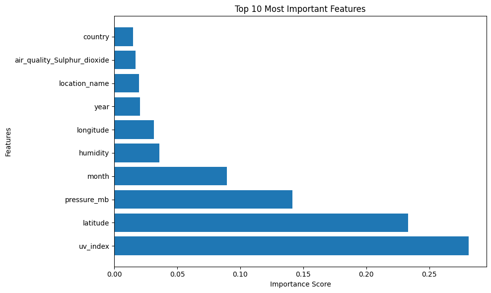
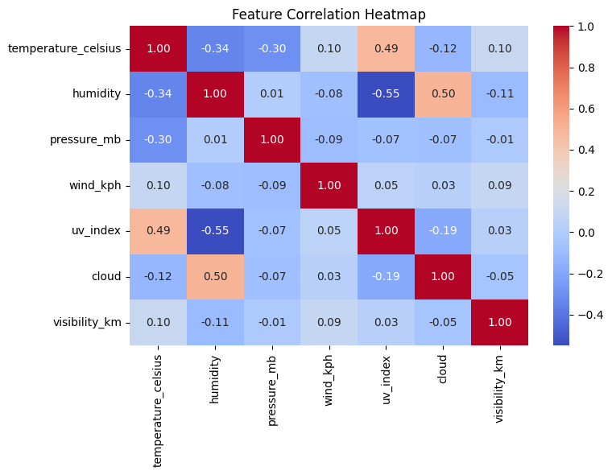
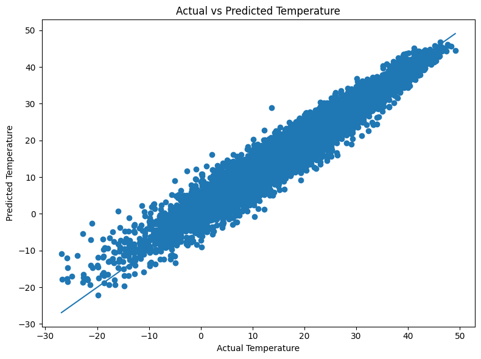
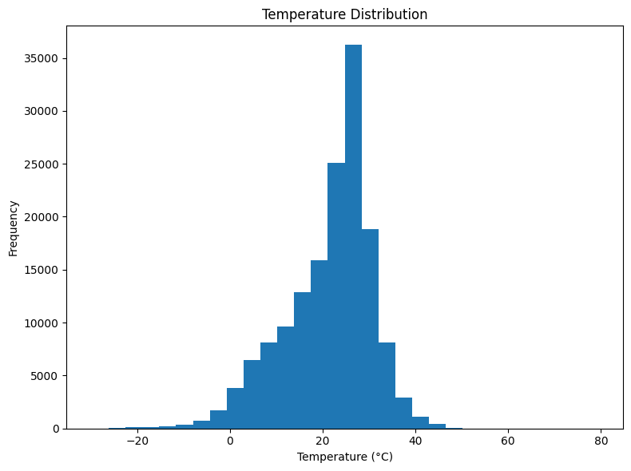

# 🌦️ Weather Temperature Prediction using XGBoost

## Overview

This project presents a production-ready machine learning solution for weather temperature forecasting using **XGBoost Regression**. The model predicts air temperature in Celsius (`temperature_celsius`) from meteorological measurements, air-quality indicators, geographical coordinates, and temporal features.

The solution has been trained, validated, and integrated into a Streamlit web application for interactive predictions and deployment.

---

## Project Objective

The primary objective of this project is to accurately estimate temperature values using environmental and atmospheric conditions.

The model leverages:

* Weather observations
* Atmospheric measurements
* Air-quality indicators
* Geographic coordinates
* Temporal information

to generate robust and reliable temperature predictions.

---

## Dataset Information

| Attribute                  | Value                        |
| -------------------------- | ---------------------------- |
| Dataset Size               | 152,802 Records              |
| Total Features             | 44                           |
| Features Used for Training | 26                           |
| Target Variable            | temperature_celsius          |
| Domain                     | Global Weather & Air Quality |

### Dataset Highlights

* 152,802 weather observations
* Multiple countries and locations
* Air-quality measurements
* Weather condition indicators
* Geographic coordinates
* Time-based weather records

---

## Model Information

| Attribute         | Value                            |
| ----------------- | -------------------------------- |
| Algorithm         | XGBoost Regressor (XGBRegressor) |
| Learning Type     | Supervised Learning              |
| Task              | Regression                       |
| Target Variable   | temperature_celsius              |
| Input Features    | 26                               |
| Model Format      | XGBoost JSON (.json)             |
| Deployment Status | Ready                            |

---

## Model Performance

| Metric                         | Value  |
| ------------------------------ | ------ |
| Mean Absolute Error (MAE)      | 1.51   |
| Root Mean Squared Error (RMSE) | 2.05   |
| R² Score                       | 0.9532 |

### Performance Summary

* Explains approximately 95.3% of variance in temperature values.
* Average prediction error remains close to 1.5°C.
* Low RMSE indicates strong predictive consistency.
* Demonstrates excellent forecasting performance.

---

## Feature Importance Analysis

Feature importance analysis was performed using XGBoost to identify the variables contributing most strongly to temperature prediction.

### Key Insights

* UV Index emerged as the strongest predictor.
* Geographic location significantly influences temperature.
* Atmospheric pressure contributes strongly to model predictions.
* Seasonal patterns captured through temporal features improve forecasting performance.

### Feature Importance Visualization



---

## Correlation Analysis

A correlation study was conducted to understand relationships among major weather variables.

### Findings

* Temperature exhibits meaningful relationships with atmospheric variables.
* Environmental indicators provide complementary predictive information.
* Correlation analysis supported feature selection and model development decisions.

### Correlation Heatmap



---

## Actual vs Predicted Analysis

Predicted temperatures were compared against actual observations to evaluate model accuracy.

### Results

The close alignment of predictions with actual temperature values demonstrates strong predictive capability and validates the achieved R² score.

### Actual vs Predicted Visualization



---

## Temperature Distribution Analysis

The distribution of temperature observations was analyzed to understand data coverage and variability.

### Insights

* The dataset contains a broad range of temperature values.
* The model was trained on diverse climatic conditions.
* This diversity supports stronger generalization across locations.

### Temperature Distribution Visualization



---

## Loading the Model

```python
from xgboost import XGBRegressor

model = XGBRegressor()
model.load_model("weather_model.json")
```

---

## Running Predictions

```python
predictions = model.predict(X)
print(predictions[:5])
```

Example Output:

```python
[22.53, 15.67, 24.18, 10.45, 25.98]
```

---

## Streamlit Application

Run the application locally:

```bash
streamlit run app.py
```

### Features

* Upload weather datasets (.csv)
* Generate temperature predictions
* View prediction results
* Download prediction outputs

---

## Repository Structure

```text
weather-temperature-prediction/
│
├── app.py
├── weather_model.json
├── requirements.txt
├── README.md
├── .gitignore
└── assets/
    ├── feature_importance.png
    ├── correlation_heatmap.png
    ├── actual_vs_predicted.png
    └── temperature_distribution.png
```

---

## Technologies Used

* Python
* Pandas
* NumPy
* Scikit-Learn
* XGBoost
* Streamlit
* Matplotlib
* Seaborn

---

## Deployment Readiness

✔ Model Validation Completed

✔ Feature Compatibility Verified

✔ Streamlit Application Tested

✔ Prediction Pipeline Verified

✔ JSON Model Successfully Loaded

✔ Deployment Ready

---

## Conclusion

This project presents a production-ready weather temperature prediction system powered by XGBoost Regression. Trained on more than 152,000 weather records and validated through comprehensive testing, the model delivers strong predictive performance with an R² score of 0.9532, low prediction error, and a fully validated inference pipeline. The solution is suitable for forecasting, analytics, application integration, and cloud deployment.
