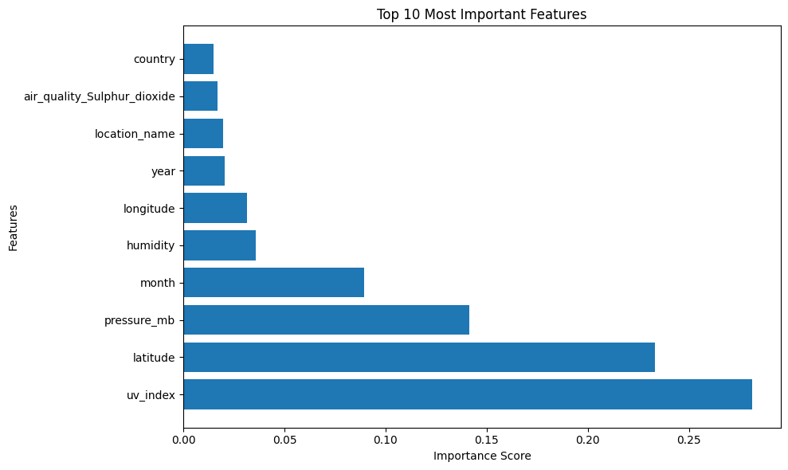
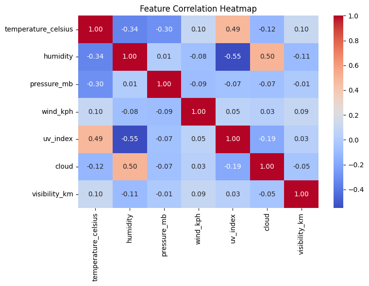
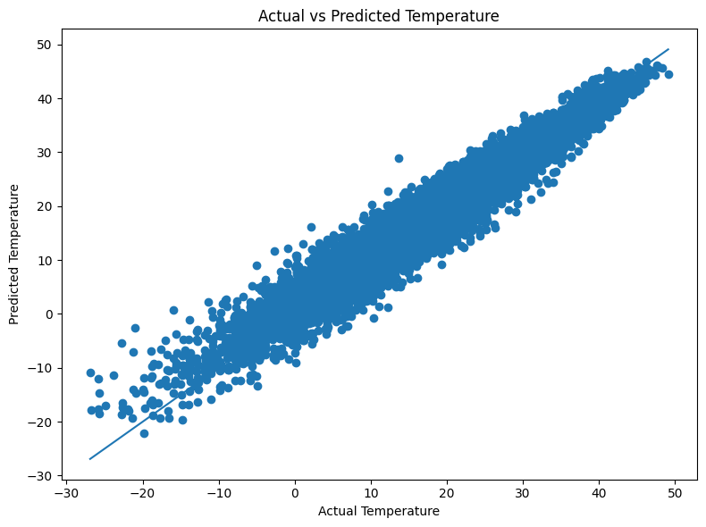
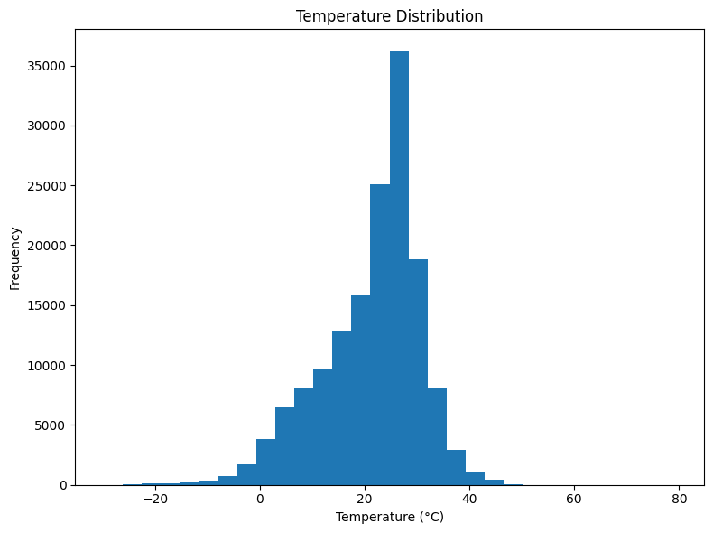

# 🌦️ Weather Temperature Prediction using XGBoost

> **An end-to-end machine learning solution for predicting air temperature from global weather, environmental, air-quality, geographic, and temporal data.**

## 🚀 Live Demo

**[🌐 Try the Interactive Streamlit Application](https://global-weather-temperature-forecasting-qel6mvbfqvqwb4o28ojthl.streamlit.app/)**

---

## 📊 Project Highlights

|                       |                              |
| --------------------- | ---------------------------- |
| 🌍 **Dataset**        | 152,802 weather observations |
| 🔢 **Input Features** | 26                           |
| 🤖 **Model**          | XGBoost Regressor            |
| 🎯 **Task**           | Regression                   |
| 📉 **MAE**            | **1.51°C**                   |
| 📐 **RMSE**           | **2.05°C**                   |
| 📈 **R² Score**       | **0.9532**                   |
| 🚀 **Deployment**     | Streamlit                    |
| 📦 **Model Format**   | XGBoost JSON                 |

---

## 💡 Project Overview

This project demonstrates a complete **machine learning workflow for weather temperature prediction**, from data preparation and feature analysis to model development, evaluation, and deployment.

The XGBoost regression model predicts **air temperature in Celsius (`temperature_celsius`)** using 26 features representing:

* 🌍 Geographic information
* 🌤️ Weather and atmospheric conditions
* 🫁 Air-quality measurements
* 🕒 Temporal information

The trained model has been integrated into an interactive **Streamlit web application**, allowing users to upload weather data, generate predictions, view results, and download prediction outputs.

---

## 🎯 Project Objective

The objective of this project is to build a practical machine learning system capable of estimating temperature from real-world environmental and atmospheric observations.

The workflow combines:

**Weather Data → Feature Processing → XGBoost Model → Evaluation → Prediction → Visualization → Streamlit Deployment**

---

## ✨ Key Capabilities

* 🌡️ **Temperature Prediction** — Predicts air temperature in Celsius.
* 🌍 **Global Weather Analysis** — Uses weather observations from multiple countries and locations.
* 🤖 **XGBoost Regression** — Applies gradient-boosted decision trees for supervised regression.
* 📊 **Model Evaluation** — Uses MAE, RMSE, and R² to evaluate predictive performance.
* 🔎 **Feature Importance Analysis** — Identifies variables contributing strongly to model predictions.
* 📈 **Actual vs Predicted Analysis** — Visualizes prediction accuracy against observed temperatures.
* 🔥 **Correlation Analysis** — Examines relationships between major weather variables.
* 📁 **CSV Prediction Workflow** — Supports weather dataset uploads.
* 📥 **Prediction Export** — Allows users to download generated prediction results.
* 🚀 **Interactive Deployment** — Provides a usable Streamlit-based prediction interface.

---

# 🗂️ Dataset

## Dataset Information

| Attribute                      | Details                      |
| ------------------------------ | ---------------------------- |
| **Dataset Size**               | 152,802 records              |
| **Total Features**             | 44                           |
| **Features Used for Training** | 26                           |
| **Target Variable**            | `temperature_celsius`        |
| **Domain**                     | Global Weather & Air Quality |

## Dataset Source

The dataset was obtained from the **Global Weather Repository** dataset on Kaggle by N. Elgiriyewithana.

**Source:** [Global Weather Repository — Kaggle](https://www.kaggle.com/datasets/nelgiriyewithana/global-weather-repository)

### Dataset Details

* **Dataset:** Global Weather Repository
* **File:** `GlobalWeatherRepository.csv`
* **Target:** `temperature_celsius`
* **Domain:** Global Weather & Air Quality

### Dataset Characteristics

* 152,802 weather observations
* Multiple countries and locations
* Meteorological measurements
* Air-quality measurements
* Weather condition information
* Geographic coordinates
* Time-based weather records

---

# 🤖 Machine Learning Model

| Attribute          | Details                            |
| ------------------ | ---------------------------------- |
| **Algorithm**      | XGBoost Regressor (`XGBRegressor`) |
| **Learning Type**  | Supervised Learning                |
| **Task**           | Regression                         |
| **Target**         | `temperature_celsius`              |
| **Input Features** | 26                                 |
| **Model Format**   | XGBoost JSON (`.json`)             |
| **Deployment**     | Streamlit                          |

XGBoost was selected to model potentially complex and non-linear relationships between environmental conditions and temperature.

---

# 🧩 Input Features

The model uses **26 input features** across four major categories.

|  # | Feature                        | Category          |
| -: | ------------------------------ | ----------------- |
|  1 | `country`                      | Geographic        |
|  2 | `location_name`                | Geographic        |
|  3 | `latitude`                     | Geographic        |
|  4 | `longitude`                    | Geographic        |
|  5 | `condition_text`               | Weather Condition |
|  6 | `wind_kph`                     | Weather           |
|  7 | `wind_degree`                  | Weather           |
|  8 | `wind_direction`               | Weather           |
|  9 | `pressure_mb`                  | Atmospheric       |
| 10 | `precip_mm`                    | Weather           |
| 11 | `humidity`                     | Weather           |
| 12 | `cloud`                        | Weather           |
| 13 | `visibility_km`                | Weather           |
| 14 | `uv_index`                     | Environmental     |
| 15 | `air_quality_Carbon_Monoxide`  | Air Quality       |
| 16 | `air_quality_Ozone`            | Air Quality       |
| 17 | `air_quality_Nitrogen_dioxide` | Air Quality       |
| 18 | `air_quality_Sulphur_dioxide`  | Air Quality       |
| 19 | `air_quality_PM2.5`            | Air Quality       |
| 20 | `air_quality_PM10`             | Air Quality       |
| 21 | `air_quality_us-epa-index`     | Air Quality       |
| 22 | `air_quality_gb-defra-index`   | Air Quality       |
| 23 | `year`                         | Temporal          |
| 24 | `month`                        | Temporal          |
| 25 | `day`                          | Temporal          |
| 26 | `hour`                         | Temporal          |

### Feature Groups

**🌍 Geographic**

* Country
* Location
* Latitude
* Longitude

**🌤️ Weather & Atmospheric**

* Wind speed and direction
* Pressure
* Precipitation
* Humidity
* Cloud coverage
* Visibility
* UV index
* Weather condition

**🫁 Air Quality**

* Carbon monoxide
* Ozone
* Nitrogen dioxide
* Sulphur dioxide
* PM2.5
* PM10
* US EPA index
* GB DEFRA index

**🕒 Temporal**

* Year
* Month
* Day
* Hour

---

# 📈 Model Performance

The trained model was evaluated using standard regression metrics.

| Metric                             |     Result |
| ---------------------------------- | ---------: |
| **Mean Absolute Error (MAE)**      | **1.51°C** |
| **Root Mean Squared Error (RMSE)** | **2.05°C** |
| **R² Score**                       | **0.9532** |

### Performance Summary

* The model explains approximately **95.3% of the variance** in temperature values on the evaluated test data.
* The average absolute prediction error is approximately **1.51°C**.
* The RMSE is **2.05°C**, reflecting the overall magnitude of prediction errors.
* The results demonstrate strong predictive performance on the evaluated test data.

---

# 🔎 Feature Importance Analysis

Feature importance analysis was performed using XGBoost to identify variables contributing strongly to temperature prediction.

### Key Observations

* **UV Index** emerged as an important predictive feature.
* **Geographic location** contributes substantially to temperature variation.
* **Atmospheric pressure** provides important predictive information.
* **Temporal features** help capture seasonal and time-based patterns.

### Feature Importance Visualization



---

# 🔥 Correlation Analysis

Correlation analysis was performed to examine relationships between temperature and major weather variables.

### Key Observations

* Temperature shows meaningful relationships with several atmospheric variables.
* Environmental and air-quality variables provide additional predictive information.
* Correlation analysis helped understand relationships within the dataset during model development.

### Correlation Heatmap



---

# 🎯 Actual vs Predicted Analysis

Actual temperature values were compared with model predictions to visually evaluate predictive performance.

The visualization provides an intuitive view of how closely predicted values follow the observed temperature values.

### Actual vs Predicted Visualization



---

# 🌡️ Temperature Distribution

The temperature distribution was analyzed to understand the range and variability represented in the dataset.

### Key Observations

* The dataset contains a broad range of temperature observations.
* Multiple geographic locations contribute to diverse climatic conditions.
* The distribution provides useful context for interpreting model predictions.

### Temperature Distribution Visualization



---

# 🚀 Streamlit Application

The trained model has been integrated into a Streamlit application to provide an interactive prediction workflow.

## Application Workflow

```text
Upload Weather CSV
        ↓
Validate Input Features
        ↓
Load Trained XGBoost Model
        ↓
Generate Temperature Predictions
        ↓
View Prediction Results
        ↓
Download Results
```

## Application Features

* 📁 Upload weather datasets in CSV format
* 🤖 Load the trained XGBoost model
* 🌡️ Generate temperature predictions
* 📊 View prediction results
* 📥 Download prediction outputs

### Run Locally

```bash
streamlit run app.py
```

---

# 🧠 Model Inference

The trained XGBoost model can be loaded directly from its JSON format.

```python
from xgboost import XGBRegressor

model = XGBRegressor()
model.load_model("weather_model.json")
```

Generate predictions:

```python
predictions = model.predict(X)

print(predictions[:5])
```

Example output:

```python
[22.53, 15.67, 24.18, 10.45, 25.98]
```

---

# 📁 Repository Structure

```text
weather-temperature-prediction/
│
├── app.py
├── weather_model.json
├── requirements.txt
├── README.md
├── .gitignore
│
└── assets/
    ├── feature_importance.png
    ├── correlation_heatmap.png
    ├── actual_vs_predicted.png
    └── temperature_distribution.png
```

---

# 🛠️ Technologies Used

* **Python**
* **Pandas**
* **NumPy**
* **Scikit-Learn**
* **XGBoost**
* **Streamlit**
* **Matplotlib**
* **Seaborn**

---

# ✅ Deployment & Validation

* ✔ Model validation completed
* ✔ Feature compatibility verified
* ✔ Streamlit application tested
* ✔ Prediction pipeline tested
* ✔ XGBoost JSON model successfully loaded
* ✔ Interactive prediction workflow implemented
* ✔ Prediction export implemented
* ✔ Deployment completed

---

# 💼 Project Value

This project demonstrates practical experience across the complete machine learning lifecycle:

**Data → Modeling → Evaluation → Interpretation → Deployment**

It showcases the ability to transform a real-world dataset into a **usable, deployed machine learning application**, rather than limiting the work to model training alone.

The project can serve as a foundation for applications involving:

* Weather analytics
* Environmental monitoring
* Temperature estimation
* Data-driven forecasting
* Predictive analytics
* ML application integration

---

# 🏁 Conclusion

This project delivers an end-to-end **weather temperature prediction system using XGBoost Regression**.

Using **152,802 weather observations and 26 input features**, the model achieved an **MAE of 1.51°C, RMSE of 2.05°C, and R² of 0.9532** on the evaluated test data.

Beyond model development, the project includes feature analysis, correlation analysis, prediction visualization, CSV-based inference, downloadable results, and an interactive **Streamlit deployment**.

The result is a complete machine learning project covering **data analysis, supervised learning, model evaluation, interpretability, inference, and deployment**.
